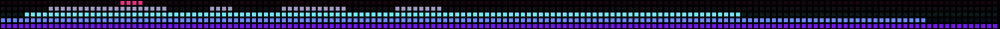

# Touch Bar App: "SoundBar" \~Make the Touch Bar Cool Again!\~



When Apple discontinued the Touch Bar models of the MacBook series, many heavy users—especially developers—preferred physical function keys for efficient keyboard input. However, with the arrival of the AI age, developers have started using AI agents and vibe coding. Now we have a chance to revive the Touch Bar's capabilities as virtual keys for prompts and AI operations.

SoundBar is a new app that actively redefines the Touch Bar for AI integration. It automatically displays audio input and output as a spectrum analyzer or VU meter on the Touch Bar with multiple visual styles. It enhances your listening experience, lets you monitor sound levels during online communications, and adds visual flair to AI voice interactions.

If you enjoy it, please consider buying me a coffee ❤️, at <https://ko-fi.com/ryojifurui>.

## What it does

- **Wakes up on its own.** When any app starts playing sound — or a microphone goes live — SoundBar takes over the Touch Bar and draws the audio in real time. When the sound stops, it hands the Touch Bar back to BetterTouchTool or macOS.
- **Hears everything, changes nothing.** Audio is captured with a macOS *process tap* on a private aggregate device: no loopback driver, no BlackHole, no changes to your output device, and the volume keys keep working. Nothing is recorded or sent anywhere — samples are turned into bar heights and thrown away.
- **Input, output, or both.** On a call, the meter can show your speakers, your microphone, or a live mix of the two (the default), so you can see yourself being heard while you listen.
- **Touch to control.** Tap the strip to change colours, two-finger tap to change patterns, double-tap to mute, long-press to dismiss, and slide with one finger for volume.
- **Lightweight.** A single ~600 KB binary, no Dock icon, a few percent of one core while drawing and idle detection driven by CoreAudio events, not polling.

> **Accessibility note:** macOS dims the Touch Bar after **75 seconds** without keyboard, trackpad or Touch Bar input, and wakes it on the next touch. That timer belongs to the system's TouchBarServer and is not exposed to apps, so SoundBar keeps drawing underneath but cannot keep the strip lit.

## Patterns

Eleven of them, switchable from the menu bar or with a two-finger tap on the strip.

**Spectrum Bars**


**Spectrum Bars ×2**


**Spectrum Mirror**


**Spectrum Mirror ×2**


**Spectrum Blocks**


**Spectrum Peaks**


**Retro Dot LED**


**Waveform**


**VU Meter**


**VU Inward**


**VU Outward**


Seven colour ramps are built in — Rainbow (the default), Green, Spectrum, Ice, Ember, Meter, Mono — and SoundBar also imports AVTouchBar-format colour sets automatically: drop them into `~/Downloads/AVTouchBar Custom Colors` and they appear in the Colour menu. (Some screenshots above use imported palettes.)

## Requirements

- A MacBook Pro **with a Touch Bar**, running **macOS 14.4 or later**. The floor is hard: SoundBar detects which apps are playing through per-process CoreAudio properties that do not exist in earlier versions.
- The prebuilt releases are **Apple Silicon** (arm64) — in practice the 13-inch MacBook Pro (M1, 2020 or M2, 2022). An Intel Touch Bar Mac would need the `TARGET` in `scripts/build.sh` changed to `x86_64-apple-macos14.4` and a build from source (untested).

## Install

**From a release:** download `SoundBar.dmg` from [Releases](https://github.com/ryoji-info/SoundBar/releases), open it, and double-click **Install SoundBar.command**. It copies the app to /Applications, registers it to start at login, and launches it. (The login agent has to name your home directory, which is why it is generated on your machine rather than shipped ready-made.)

**From source** — only Apple's Command Line Tools are needed, not Xcode:

```bash
git clone https://github.com/ryoji-info/SoundBar.git
cd SoundBar
./scripts/build.sh --install
```

### If macOS says the app is "damaged"

The releases are ad-hoc signed, not notarized. On another Mac, the quarantine flag a download carries makes Gatekeeper refuse the app with *"SoundBar is damaged and can't be opened"* — misleading wording for "unsigned and quarantined". Clear the flag and it runs:

```bash
xattr -dr com.apple.quarantine ~/Downloads/SoundBar.dmg
```

(Building from source has no such problem.)

### Permissions

macOS asks for these on first use; both are needed to draw anything:

| Permission | Why |
|---|---|
| **Screen & System Audio Recording** | macOS files system-audio capture under Screen Recording. Deny it and the Touch Bar draws a flat line — the tap still runs but every sample arrives as zero. SoundBar never reads the screen. |
| **Microphone** | Checked when the system-audio tap is created, and used for the input meter. |

Nothing else — no Accessibility, no Input Monitoring. (BetterTouchTool users may also see one optional **Automation** prompt: SoundBar asks BTT which Touch Bar group to restore after the visualiser stops. Declining it changes nothing visible.)

## Using it

The menu bar note ♪ holds everything: pattern, colour, on/off, and behaviour.

| Touch Bar gesture | Action |
|---|---|
| One-finger tap | Next colour |
| Two-finger tap | Next pattern |
| Double tap | Mute / unmute |
| Long press | Dismiss the visualiser until audio restarts |
| One-finger slide | Volume |

**Behaviour ▸ Input Meter** decides what a live microphone shows: **Off (output only)**, **Only When Nothing Is Playing**, **Mix Input and Output** (the default, made for video calls), or **Input Takes Priority**.

Power-user tunables — bar count, frame rate, visible strip width, mic gain, excluded apps — are `defaults` keys under `com.ryoji.SoundBar`, re-read live. The full table is in [docs/INTERNALS.md](docs/INTERNALS.md), along with the whole story of how this works: process taps, private aggregate devices, reading the Touch Bar digitiser through MultitouchSupport, and why the volume keys survive.

## Uninstall

Run **Uninstall SoundBar.command** from the DMG, or by hand:

```bash
launchctl bootout "gui/$(id -u)/com.ryoji.SoundBar"
rm ~/Library/LaunchAgents/com.ryoji.SoundBar.plist
rm -rf /Applications/SoundBar.app
defaults delete com.ryoji.SoundBar
rm -rf ~/Library/Logs/SoundBar ~/Library/Application\ Support/SoundBar
```

## Credits

SoundBar is inspired by [AVTouchBar](https://www.avtouchbar.com/), an earlier, well-known audio visualizer for the Touch Bar.

## License

[Apache-2.0](LICENSE).
